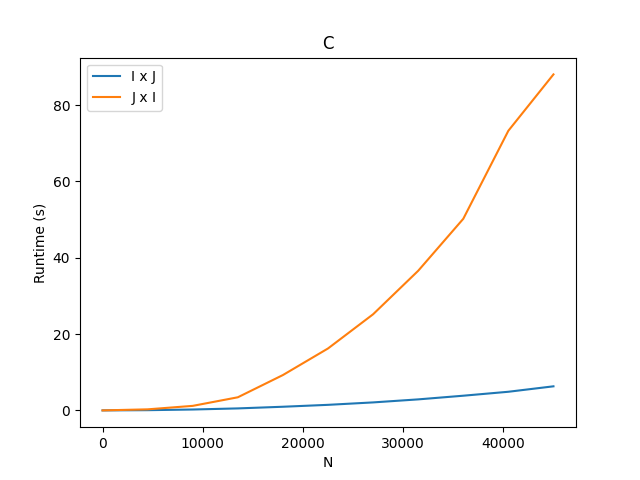
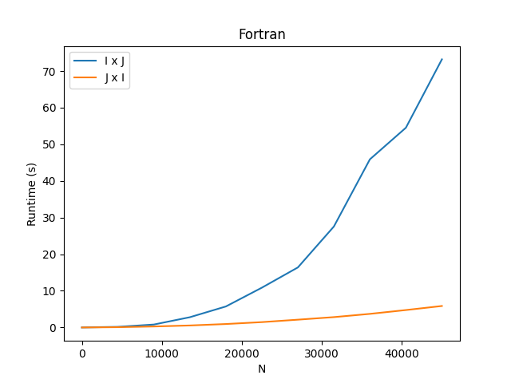

# COC472 - Trabalho 1

Exercício da matéria **Computação de Alto Desempenho** Da UFRJ. Seu objetivo é implementar a multiplicação matriz-vetor em C e Fortran, executando em 2 ordens: linha-coluna e coluna-linha e comparar os tempos de execução.

<table>
  <tr>
    <td>Gráfico da execução em C</td>
     <td>Gráfico da execução em Fortran</td>
  </tr>
  <tr>
    <td></td>
    <td></td>
  </tr>
 </table>

## Para executar o exercício

1.  Clone o repositório.

2.  Dê permissão de execução ao arquivo bash

    ```sh
    chmod +x runReport.sh
    ```

3.  Rode o script

        ```sh

    ./runReport.sh

    ```
    O script irá criar o gráfico!
    ```
